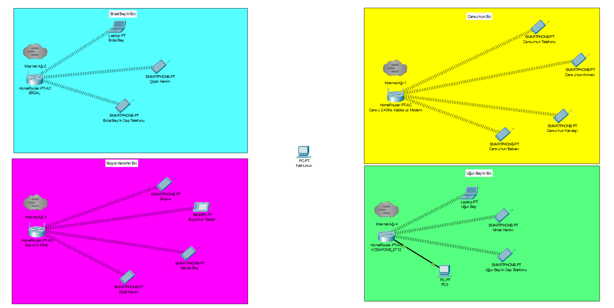
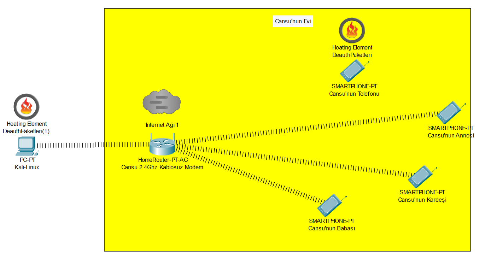
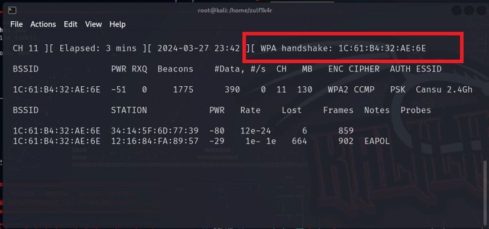
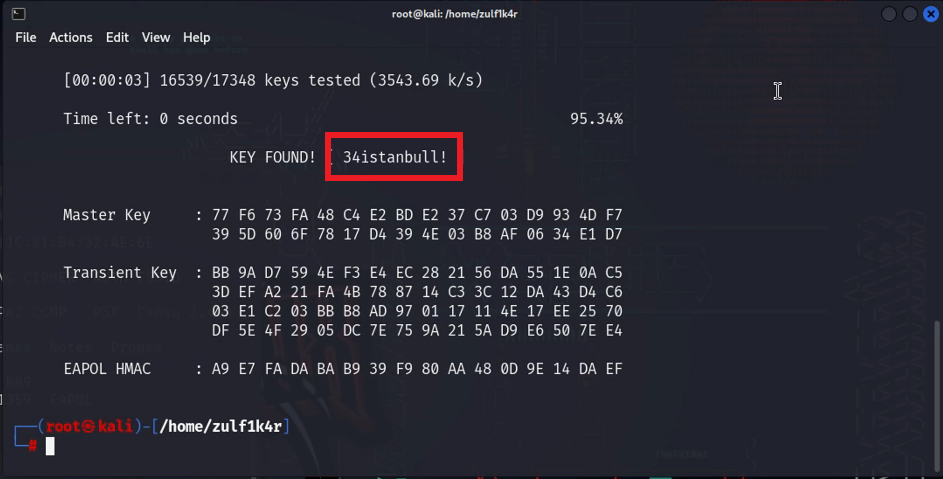

# Aircrack-ng Türkçe Kılavuz

Bu proje, kablosuz ağ güvenliği ve Aircrack-ng araç setinin kullanımına dair kapsamlı bir Türkçe rehber içermektedir. Aircrack-ng, kablosuz ağ güvenliği testlerinde kullanılan güçlü bir araçtır ve bu proje, bu araç ile modüllerini detaylı şekilde açıklamaktadır.

> ⚠️ **Not:**  
> Bu bir üniversite final projesidir. Senaryolar tamamen kurgusaldır. Bu rehberde yer alan bilgilerin yasal olmayan amaçlarla kullanılmasından yazar(lar) sorumlu değildir ve bu tür kullanımlar kesinlikle desteklenmemektedir.

## 🙌 Katkıda Bulunanlar

Bu projede bana yardımcı olan değerli ekip arkadaşlarıma teşekkür ederim:

- [İlaydanur GÜNAY](https://github.com/Kizanim0)  
- [Barış Cem ANT](https://github.com/0Baris)

Ayrıca bu süreçte bize rehberlik eden çok kıymetli hocamız  
[**Öğr. Gör. Çisem YAŞAR**](https://github.com/cyasar34) ⭐'a da sonsuz teşekkürlerimizi sunuyoruz.

---

## 📘 İçindekiler

- [Özet](#özet)
- [Projenin Amacı](#projenin-amacı)
- [İçerik Özeti](#içerik-özeti)
- [Senaryo](#Senaryo)
- [Kablosuz Ağ Saldırı Türleri](#kablosuz-ağ-saldırı-türleri)
- [Nasıl Kullanılır?](#nasıl-kullanılır)
- [Yasal Uyarı](#yasal-uyarı)
- [Katkıda Bulunun](#katkıda-bulunun)

---

## Özet

Bu proje, kablosuz ağların güvenliği ve bu ağlarda kullanılan saldırı yöntemlerine karşı alınabilecek önlemlerle ilgili bilgi sağlamaktadır. Aircrack-ng araç seti detaylı olarak ele alınmış ve modülleri ayrı ayrı incelenmiştir.

---

## Projenin Amacı

Bu kılavuzun temel amacı, kablosuz ağ güvenliğini sağlamak için kullanılan Aircrack-ng araçlarının işlevlerini ve kullanım örneklerini açıklamaktır. Kılavuz, teknik bilgi seviyesi düşük olan kullanıcıların bile anlayabileceği şekilde hazırlanmıştır.

---

## İçerik Özeti

- **Kablosuz Ağ Güvenliği:** Kablosuz ağların yapısı, saldırı türleri ve güvenlik sağlama yöntemleri.  
- **Aircrack-ng Araç Seti:** Her bir modülün işlevi ve kullanım örnekleri.  
- **Uygulamalı Senaryolar:** Gerçekçi ve deneysel ortamlarda ağ güvenliği testleri.

---

## Senaryo

Aircrack-ng araç setindeki bazı temel modüller şunlardır:

- **Çevredeki Ağlar:**
  

- **Aireplay-ng Aracı İle Ağdan Cihaz Düşürme Simülasyon:**
  

- **WPA-HANDSHAKE Ele Geçirme**
  

- **Aircrack-ng İle Şifre Kırma**
  

---

## Kablosuz Ağ Saldırı Türleri

Kılavuzda ele alınan saldırı türlerinden bazıları:

- **Brute Force (Kaba Kuvvet):** Tüm şifre kombinasyonlarını deneyerek şifreyi kırma.  
- **Evil Twin (Şeytani İkiz):** Sahte bir ağ oluşturup kullanıcıları kandırma.  
- **MITM (Ortadaki Adam):** Veri trafiğini dinleyerek manipüle etme.

Her saldırı türüne karşı alınabilecek korunma yöntemleri de açıklanmıştır.

---

## Nasıl Kullanılır?

1. **Kılavuzu İndirin:** PDF dosyasını bilgisayarınıza indirerek inceleyin.  
2. **Aircrack-ng Kurulumu:** [Aircrack-ng](https://www.aircrack-ng.org/) resmi sitesinden indirip kurun.  
3. **Deneysel Çalışmalar:** Kılavuzdaki senaryoları sadece izinli ağlar üzerinde test edin.

---

## Yasal Uyarı

Bu kılavuz yalnızca eğitim amaçlıdır. Araçlar yalnızca size ait veya izinli ağlar üzerinde kullanılmalıdır. Aksi kullanım yasal sonuçlar doğurabilir.

---

## Katkıda Bulunun

Projeye katkı sağlamak için:

1. Bu repository'yi fork'layın.  
2. Değişikliklerinizi yapın.  
3. Pull request gönderin.
